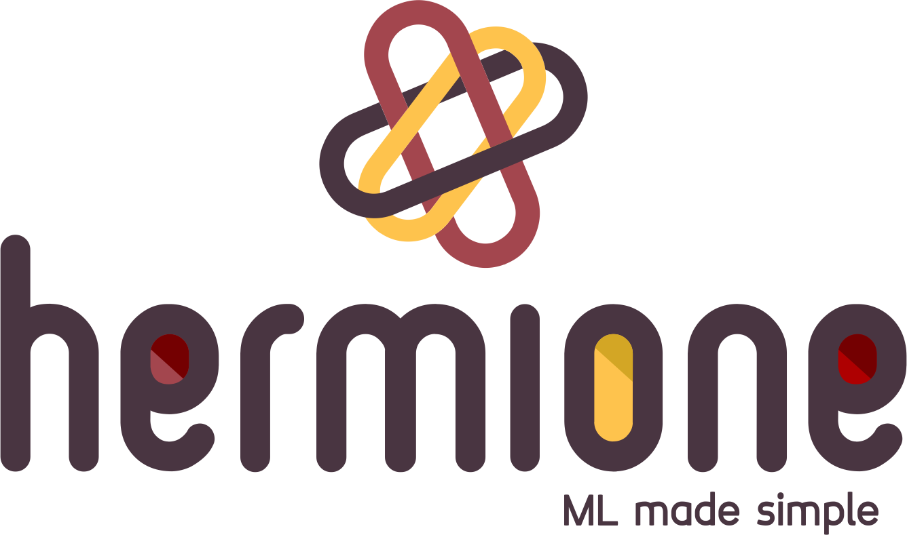
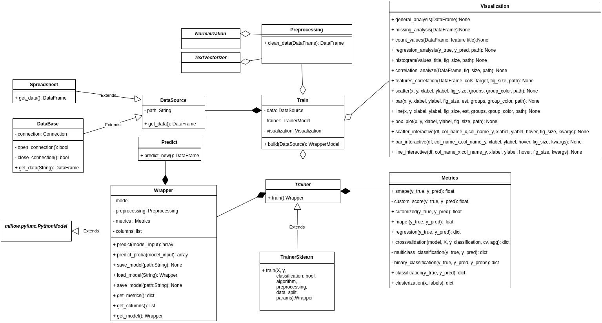

[](https://pypi.python.org/pypi/hermione-ml/)

[](https://opensource.org/licenses/Apache-2.0)
[](https://GitHub.com/a3data/hermione/issues/)
[](https://GitHub.com/a3data/hermione/issues?q=is%3Aissue+is%3Aclosed)
[](https://pypi.python.org/pypi/hermione-ml/)
[](https://pypi.python.org/pypi/hermione-ml/)
[](https://crate.io/packages/hermione-ml/)


[](https://www.python.org/)

A Data Science Project struture in cookiecutter style.

Developed with ❤️ by <a href="http://www.a3data.com.br/" target="_blank">A3Data</a>

  

## What is Hermione?

  

Hermione is the newest **open source** library that will help Data Scientists on setting up more organized codes, in a quicker and simpler way. Besides, there are some classes in Hermione which assist with daily tasks such as: column normalization and denormalization, data view, text vectoring, etc. Using Hermione, all you need is to execute a method and the rest is up to her, just like magic.

### Why Hermione?
To bring in a little of **A3Data** experience, we work in Data Science teams inside several client companies and it’s undeniable the excellence of notebooks as a data exploration tool. Nevertheless, when it comes to data science products and their context, when the models needs to be consumed, monitored and have periodic maintenance, putting it into production inside a Jupyter Notebook is not the best choice (we are not even mentioning memory and CPU performance yet). And that’s why **Hermione comes in**!
We have been inspired by this brilliant, empowered and awesome witch of The Harry Potter saga to name this framework!

This is also our way of reinforcing our position that women should be taking more leading roles in the technology field. **#CodeLikeAGirl**

## Installing


### Dependencies

- Python (>= 3.6)
- **docker**

Hermione does not depend on conda to build and manage virtual environments anymore. It uses `venv` instead.


### Install

```python

pip install -U hermione-ml

```

### Enabling autocompletion (unix users):

For bash:

```bash
echo 'eval "$(_HERMIONE_COMPLETE=source_bash hermione)"' >> ~/.bashrc
```

For Zsh:

```bash
echo 'eval "$(_HERMIONE_COMPLETE=source_zsh hermione)"' >> ~/.zshrc
```

## How do I use Hermione?
After installed Hermione:
1.  Create you new project:

```
hermione new project_hermione
```

1. Hit Enter if you want to start with an example code

```
Do you want to start with an implemented example (recommended) [y/n]? [y]: 
```

3. Hermione already creates a virtual environment for the project. For Windows users, activate it with

```cmd
<project_name>_env\Scripts\activate
```

For linux and MacOS users, do

```bash
source <project_name>_env/bin/activate
```


4. After activating, you should install some libraries. There are a few suggestions in “requirements.txt” file:

```
pip install -r requirements.txt
```

1. Now we will train some models from the example, using MLflow ❤. To do so, inside *src* directory, just type: _hermione train_. The “hermione train” command will search for a `train.py` file and execute it. In the example, models and metrics are already controlled via MLflow.


6. After that, a mlflow experiment is created. To verify the experiment in mlflow, type: mlflow ui. The application will go up.

```
mlflow ui
```

    [2020-10-19 23:23:12 -0300] [15676] [INFO] Starting gunicorn 19.10.0
    [2020-10-19 23:23:12 -0300] [15676] [INFO] Listening at: http://127.0.0.1:5000 (15676)
    [2020-10-19 23:23:12 -0300] [15676] [INFO] Using worker: sync
    [2020-10-19 23:23:12 -0300] [15678] [INFO] Booting worker with pid: 15678

1. To access the experiment, just enter the path previously provided in your preferred browser. Then it is possible to check the trained models and their metrics.


8. To make batch predictions using your `predict.py` file, type `hermione predict`. The default implemented version will print some predictions for you in the terminal.

```
hermione predict
```

9.  In the Titanic example, we also provide a step by step notebook. To view it, just type jupyter notebook inside directory `/src/notebooks/`.


Do you want to create your **project from scratch**? There click [here](tutorial_base.md) to check a tutorial.


# Docker

Hermione comes with a default `Dockerfile` which implements a Flask + Gunicorn API that serves your ML model. You should take a look at the `api/app.py` module and rewrite `predict_new()` function as you see fit.  

Also, in the newest version, hermione brings two CLI commands that helps us abstract a little bit the complexity regarding docker commands. To build an image (remember you should have docker installed), you should be in the project's root directory. Than, do:

```bash
hermione build <IMAGE_NAME>
```

After you have built you're docker image, run it with:

```bash
hermione run <IMAGE_NAME>
```

    [2020-10-20 02:13:20 +0000] [1] [INFO] Starting gunicorn 20.0.4
    [2020-10-20 02:13:20 +0000] [1] [INFO] Listening at: http://0.0.0.0:5000 (1)
    [2020-10-20 02:13:20 +0000] [1] [INFO] Using worker: sync
    [2020-10-20 02:13:20 +0000] [7] [INFO] Booting worker with pid: 7
    [2020-10-20 02:13:20 +0000] [8] [INFO] Booting worker with pid: 8
    [2020-10-20 02:13:20 +0000] [16] [INFO] Booting worker with pid: 16

**THAT IS IT!** You have a live model up and running. To test your API, hermione provides a `api/myrequests.py` module. *This is not part of the project*; it's a "ready to go" code to make requests to the API. Help yourself!

```bash
cd src/api
python myrequests.py
```

    Sending request for model...
    Data: {"Pclass": [3, 2, 1], "Sex": ["male", "female", "male"], "Age": [4, 22, 28]}
    Response: "[0.24630952 0.996      0.50678968]"

Play a little with the 'fake' data and see how far can the predictions go.


## Documentation
This is the class structure diagram that Hermione relies on:



Here we describe briefly what each class is doing:

### Data Source
-   **DataBase** - should be used when data recovery requires a connection to a database. Contains methods for opening and closing a connection.
-   **Spreadsheet**  - should be used when data recovery is in spreadsheets/text files. All aggregation of the bases to generate a "flat table" should be performed in this class.
-   **DataSource**  - abstract class which DataBase and Spreadsheet inherit from.


### Preprocessing

-   **Preprocessing**  - concentrates all preprocessing steps that must be performed on the data before the model is trained.
-   **Normalization** - applies normalization and denormalization to reported columns. This class contains the following normalization algorithms already implemented: StandardScaler e MinMaxScaler.
-   **TextVectorizer**  - transforms text into vector. Implemented methods: Bag of words, TF_IDF, Embedding: mean, median e indexing.

### Visualization

-   **Visualization** - methods for data visualization. There are methods to make static and interactive plots.
-   **App Streamlit** - streamlit example consuming Titanic dataset, including pandas profilling.

### Model

-   **Trainer**  - module that centralizes training algorithms classes. Algorithms from `scikit-learn` library, for instance, can be easily used with the TrainerSklearn implemented class.
-   **Wrapper** - centralizes the trained model with its metrics. This class has built-in integration with MLFlow.
-   **Metrics** - it contains key metrics that are calculated when models are trained. Classification, regression and clustering metrics are already implemented.

### Tests
-   **test_project** - module for unit testing.
  

## Contributing

Have a look at our [contributing guide](CONTRIBUTING.md).

Make a pull request with your implementation.

For suggestions, contact us: hermione@a3data.com.br

## Licence
Hermione is open source and has Apache 2.0 License: [](https://opensource.org/licenses/Apache-2.0)