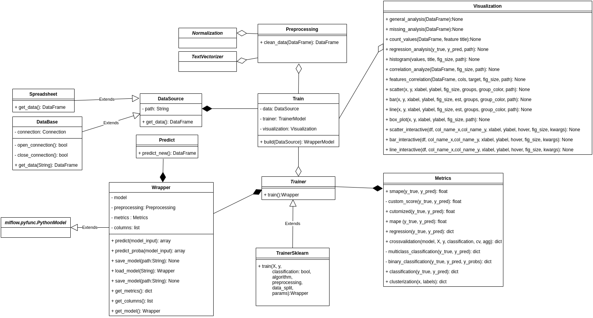

# Hermione - ML made simple

[](https://www.python.org/)


[](https://lbesson.mit-license.org/)
[](https://GitHub.com/a3data/hermione/issues/)
[](https://GitHub.com/a3data/hermione/issues?q=is%3Aissue+is%3Aclosed)

 ```
  _                         _                  
| |__   ___ _ __ _ __ ___ (_) ___  _ __   ___ 
| '_ \ / _ \ '__| '_ ` _ \| |/ _ \| '_ \ / _ \
| | | |  __/ |  | | | | | | | (_) | | | |  __/
|_| |_|\___|_|  |_| |_| |_|_|\___/|_| |_|\___|
```

A Data Science Project struture in cookiecutter style.

Developed with ❤️ by [A3Data](http://www.a3data.com.br/)

  

## What is Hermione?

  

Hermione is the newest **open source** library that will help Data Scientists on setting up way more organized codes , in a quicker and simpler way. Besides, there're some classes in Hermione which assist with daily tasks such as : column normalization and denormalization, data view, text vectoring, etc. Using the Hermione, all you need is to execute a method and the rest is up to her, just like magic.

### Why Hermione?
To bring in a little of the **A3Data** experience, we work in Data Science teams inside several client companies and it’s undeniable the excellence of notebooks as a data exploration tool. Nevertheless, when it comes to the product and its context, when the models needs to be consumed, monitored and have periodic maintenance, putting it into production inside a Jupyter Notebook is not the best choice(we are not even mentioning memory and CPU performance yet). And that’s why **Hermione appears**!
We have been inspired by this brilliant, empowered and awesome witch of Harry Potter  to name this framework!
It's a way reinforce we posture, A3Data, about female empowered in Technology.

## Installing


### Dependences

- Python (>= 3.6)
  

### Install

```python

pip install hermione

```
## How do I use Hermione?
After installed Hermione:
1.  Create you new project:

 

2. Enter “y” to implement the example code


3. As we mentioned before, Hermione already creates a conda virtual environment for the project, activate it:


4. After activating, you should install some libraries. There are a few suggestions in “requirements.txt” file:


5. Now we will train the model from the example, using MLflow ❤ .To do so, just type, into the directory, src: _hermione train_. The “hermione train” command will search for a train.py file and execute it. In the example, models and metrics are already controlled via MLflow.


6. After that, a mlflow experiment is created. To verify the experiment in mlflow, type: mlflow ui. The application will go up.


7. To access the experiment, just enter the way previously provided in your preferred browser. Then it is possible to check the trained models and their metrics.


8. In the Titanic example, we also provide a step by step notebook. To view it, just type jupyter notebook into the path /src /notebooks/.


## Documentation
This diagram is a class structure from Hermione:



Here we describe briefing what each class is doing in Hermione:

### Data Source
-   **DataBase** - should be used when data recovery requires a connection to the database. Contains methods for opening and closing a connection.
-   **Spreadsheet**  - should be used when data recovery is in spreadsheets / text files. All aggregation of the bases to generate the  "flat table" must be performed in this class.
-   **DataSource**  - abstract class that requires classes that inherit implement obter_dados method.


### Preprocessing

-   **Preprocessing**  - concentrates all the pre-processing that must be performed on the data before the model is generated.
-   **Normalization** - applies normalization and denormalization to the reported columns. This class contains the following normalization algorithms: StandardScaler e MinMaxScaler.
-   **TextVectorizer**  - transforms the text into a vector. Implemented methods: Bag of words, TF_IDF, Embedding: mean, median e indexing.

### Visualization

-   **Visualization** - methods to visualization. There are methods that plot in a physical and interactive way.

### Model

-   **Trainer**  - centralize the algorithms to be used in the training. In this class there is the algorithm: Sklearn.
-   **Wrapper** - centralizes the trained model with its metrics. This class has integration with MLFlow.
-   **Metrics** - It has the key metrics that are calculated in the models. Has methods for the metrics of classification, regression and clustering models.

### Tests
-   **test_project** - unit testing implemented
  

## Contributing

  Make a pull request with your implementation.

For suggestions, contact us: hermione@a3data.com.br

## Licence
Open Source (OSI approved): 