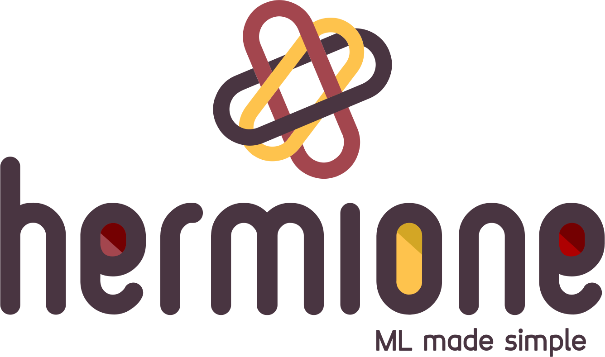

A Data Science Project struture in cookiecutter style.

Developed with ❤️ by <a href="http://www.a3data.com.br/" target="_blank">A3Data</a>

## What is Hermione?

  

Hermione is the newest **open source** library that will help Data Scientists on setting up more organized codes, in a quicker and simpler way. Besides, there are some classes in Hermione which assist with daily tasks such as: column normalization and denormalization, data view, text vectoring, etc. Using Hermione, all you need is to execute a method and the rest is up to her, just like magic.

### Why Hermione?
To bring in a little of **A3Data** experience, we work in Data Science teams inside several client companies and it’s undeniable the excellence of notebooks as a data exploration tool. Nevertheless, when it comes to data science products and their context, when the models needs to be consumed, monitored and have periodic maintenance, putting it into production inside a Jupyter Notebook is not the best choice (we are not even mentioning memory and CPU performance yet). And that’s why **Hermione comes in**!
We have been inspired by this brilliant, empowered and awesome witch of The Harry Potter saga to name this framework!

This is also our way of reinforcing our position that women should be taking more leading roles in the technology field. **#CodeLikeAGirl**

## Licence
Hermione is open source and has Apache 2.0 License: [](https://opensource.org/licenses/Apache-2.0)


```{toctree}
:maxdepth: 2
:hidden:
:caption: Getting started

Installing
QuickStart
```

```{toctree}
:maxdepth: 2
:hidden:
:caption: Usage

ProjectStructure

```

.. automodule:: hermione.__IMPLEMENTED_BASE__.src
    :members:

```{toctree}
:maxdepth: 2
:hidden:
:caption: Contributing

Contributing

```