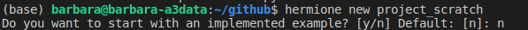

## Start your project from scratch with Hermione

1. After you have installed Hermione, you need to create your project:



2. Activate it environment:

 

3. Now we are going to install by default libraries that are in file ``requirements.txt``:


4. When you create a project at Hermione, it already creates a configuration file, this file can be found at ``src/config/config.json``. This file sets some project settings data, and if you find it necessary, you can change it, including new fields or changing existing ones:

```json
{
"project_name": "project_scratch",
"env_path": "project_scratch/project_scratch_env",
"files_path": "../data/raw/",
"key": "<<<<key>>>>",
"user": "<<<<user>>>>"
}
```
5. The first step in creating our project is to load the database. In this tutorial we will use the Titanic dataset. For that we load it in the class ``Spreadsheet`` in the method ``get_data`` as follows the example below:

```python
def  get_data(self, path)->pd.DataFrame:
	"""
	Returns a flat table in Dataframe
	Parameters
	----------
	arg : type
	description
	Returns
	-------
	pd.DataFrame
	Dataframe with data
	"""
	return pd.read_csv(path)[['Survived', 'Pclass', 'Sex', 'Age']]
```
6. Then we need to apply pre-processing to our database, this is done in the class ``Preprocessing`` in the method ``process``:
```python
def  process(self, df: pd.DataFrame):
	"""
	Perform data cleansing.
	Parameters
	----------
	df : pd.Dataframe
	Dataframe to be processed 

	Returns
	-------
	pd.Dataframe
	Cleaned Data Frame
	"""
	print("Cleaning data")
	df_copy = df.copy()
	df_copy['Pclass'] = df_copy.Pclass.astype('object')
	df_copy = df_copy.dropna()
	df_copy = pd.get_dummies(df_copy)
	return df_copy
```

Here we apply three pre-processing: transformation of the column `` Pclass`` to the type `` object``, removal of empty lines and creation of dummies.

7. The next step is to define the algorithm that we will be training. If you are going to run your model with some sklearn algorithm, the ``TrainerSklearn`` class already has the implementation and you just need to call the ``train`` method, passing some parameters. The ``train`` method also supports training with cross validation or just dividing into training and testing (all parameterized).
If you need to use another package, just implement your own class, inheriting from the ``Trainer`` class. Similar to what was implemented in ``TrainerSklearn``:

```python
class  TrainerSklearn(Trainer):
	pass
```

8. Now that we have loaded the data, implemented the pre-processing and already have the method to train, we need to join these steps, that is, set up our execution pipeline.
At Hermione this process must be performed in the **script** ``train.py``. So come on!


	8.1. Load the project name, defined in the config file (step 4).
	```python
	with  open('config/config.json', 'r') as  file:
		project_name = json.load(file)['project_name']
	```
	8.2. Create an experiment in mlflow:
	```python
	mlflow.set_experiment(project_name)
	```
	8.3. Enter the path of the dataset to be loaded by the ``Spreadsheet`` class (step 5):
	```python
	df = Spreadsheet().get_data('../data/raw/train.csv')
    ```
	8.3. Apply the preprocessing defined in step 6:
	```python
	p = Preprocessing()
	df = p.process(df)
	```
	8.4. Define features (X) and target (y):
	```python
	X = df.drop(columns=["Survived"])
	y = df["Survived"]
	```
	8.5. Define the sklearn algorithms that we will apply:
	```python
	algos = [RandomForestClassifier, GradientBoostingClassifier, LogisticRegression]	
	```
	8.6. Now we will configure the execution of the algorithms, using the ``TrainerSklearn`` class (step 7). Here we train with mlflow so that the results can be stored and analyzed later:
	```python
	for algo in algos:
		with mlflow.start_run() as run:
			model = TrainerSklearn().train(X, y,
										   classification=True,
										   algorithm=algo,
										   data_split=('cv', {'cv': 8}),
										   preprocessing=p)
		   mlflow.log_params({'algorithm': algo})
		   mlflow.log_metrics(model.get_metrics())
		   mlflow.sklearn.log_model(model.get_model(), 'model')
	```
	8.7. After the ``train.py`` script has been built, with the previous steps. You need to run it. You can do this in two ways:
	
	 - Run the entire script on the python console
	 - Run the ``hermione train`` command, in the ``src`` folder

	
9. After executing step 8.7 the models, their parameters and metrics are logged in mlflow. To access them, simply execute the command below at the command prompt inside the path ``src/``:
 
```ssh
mlflow ui
``` 
10. Open the URL, which the previous command returns, in your preferred browser. So you can analyze the results returned:


Ready! Now you have built a project from scratch using Hermione.